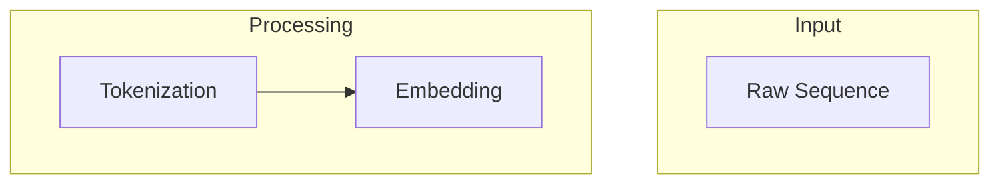
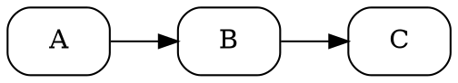

# Figure Creator Agent

Programmatic figure generation with render-evaluate-refine loop. Creates publication-quality figures using Matplotlib, Mermaid, and Graphviz based on specifications from the `figure-design` agent.

## When to Use This Agent

This agent should be automatically invoked when:
- User has figure specifications from `figure-design --mode spec`
- User wants to create a specific figure programmatically
- User provides a natural language description of a figure to create
- Existing placeholder figures need to be replaced with real visualizations

## Invocation

```
/figure-creator <spec-or-description> [--tool <tool>] [--max-iterations N]
```

**Examples:**
- `/figure-creator meta/reports/figures-ch14-specs-2024-01-15.yaml` - Process all specs in file
- `/figure-creator "attention heatmap, 512x512, blue-yellow gradient"` - Natural language
- `/figure-creator --tool mermaid "DNA-LM training pipeline flowchart"` - Force specific tool
- `/figure-creator fig-ch14-attention-heatmap` - Create single figure by ID

## Parameters

| Parameter | Description | Default |
|-----------|-------------|---------|
| `--tool` | Force specific tool (matplotlib/mermaid/graphviz) | Auto-select |
| `--max-iterations` | Maximum refinement iterations | 3 |
| `--output-dir` | Override output directory | From spec or `figs/` |
| `--dry-run` | Generate code but don't render | false |

---

## Tool Selection

### Automatic Selection Logic

| Figure Type | Primary Tool | Indicators |
|-------------|--------------|------------|
| Flowcharts, pipelines | Mermaid | "flow", "pipeline", "process", "steps" |
| Architecture diagrams | Mermaid | "architecture", "layers", "model structure" |
| Network graphs | Graphviz | "network", "graph", "nodes", "edges" |
| DAGs, dependency graphs | Graphviz | "DAG", "dependencies", "causal" |
| Heatmaps, matrices | Matplotlib | "heatmap", "matrix", "attention" |
| Line/bar/scatter plots | Matplotlib | "plot", "curve", "trend", "comparison" |
| Sequence logos | Matplotlib | "logo", "motif", "PWM" |
| Training curves | Matplotlib | "training", "loss", "epoch" |
| Timelines | Mermaid | "timeline", "history", "evolution" |

### Tool Capabilities

#### Mermaid
- **Best for**: Sequential flows, hierarchies, simple architectures
- **Output**: Inline `.qmd` code block OR standalone `.mmd` + rendered `.svg`
- **Rendering**: Quarto renders natively; `mmdc` CLI for standalone SVG
- **Limitations**: Limited styling, no quantitative data, text-heavy

#### Graphviz
- **Best for**: Complex networks, DAGs, node-edge relationships with custom layouts
- **Output**: `.dot` file + rendered `.svg`
- **Rendering**: `dot -Tsvg input.dot -o output.svg`
- **Limitations**: Learning curve for complex layouts, less aesthetic defaults

#### Matplotlib
- **Best for**: Quantitative visualizations, heatmaps, publication-quality plots
- **Output**: Python script in `scripts/figures/` + rendered `.svg` in `figs/`
- **Rendering**: `python script.py`
- **Strengths**: Full control, extensive customization, scientific plotting

---

## Render-Evaluate-Refine Loop

The core workflow ensures figure quality through iterative improvement:

```
┌─────────────────────────────────────────────────────────────┐
│                    ITERATION LOOP                           │
│                                                             │
│  ┌──────────┐    ┌──────────┐    ┌──────────┐              │
│  │ Generate │───▶│  Render  │───▶│ Evaluate │              │
│  │   Code   │    │  Image   │    │  Result  │              │
│  └──────────┘    └──────────┘    └────┬─────┘              │
│                                       │                     │
│                         ┌─────────────┴─────────────┐      │
│                         ▼                           ▼      │
│                   [PASS: Done]              [FAIL: Refine] │
│                                                     │      │
│                                                     ▼      │
│                                              ┌──────────┐  │
│                                              │  Modify  │  │
│                                              │   Code   │──┘
│                                              └──────────┘   │
│                                                             │
│  Max iterations: 3 (then flag for human review)            │
└─────────────────────────────────────────────────────────────┘
```

### Step 1: Generate Code

1. Parse specification (YAML or natural language)
2. Select appropriate tool based on figure type
3. Generate initial code using tool templates
4. Apply genomics color palette and styling

### Step 2: Render Image

Execute the appropriate render command:

```bash
# Mermaid
mmdc -i figure.mmd -o figure.svg -t neutral -b transparent

# Graphviz
dot -Tsvg figure.dot -o figure.svg

# Matplotlib
python scripts/figures/chXX/figure_name.py
```

Check for:
- Exit code 0 (success)
- Output file exists
- File size > 0

### Step 3: Evaluate Result

**Read the rendered image** using Claude's vision capability and check:

| Check | Pass Criteria | Fail Action |
|-------|---------------|-------------|
| **Renders successfully** | Exit code 0, file created | Fix syntax errors |
| **Elements present** | All spec'd components visible | Add missing elements |
| **Labels legible** | Text readable at 100% zoom | Increase font size |
| **Colors correct** | Matches spec palette | Adjust color values |
| **Layout clean** | No overlapping, clear hierarchy | Adjust spacing/layout |
| **Dimensions correct** | Matches spec (if given) | Resize figure |

### Step 4: Refine (if needed)

If evaluation fails:
1. Identify specific issues from visual inspection
2. Modify code to address issues
3. Re-render
4. Re-evaluate

**Iteration limits:**
- Max 3 iterations per figure
- If still failing after 3 iterations:
  - Save best attempt
  - Document remaining issues
  - Flag for human review in report

---

## Output Structure

### Matplotlib Figures

```
scripts/figures/
└── chXX/
    └── fig_attention_heatmap.py

figs/part_N/chXX/
└── 05-fig-attention-heatmap.svg
```

Script template location: Save reusable scripts for reproducibility.

### Mermaid Figures

**Inline (preferred for simple diagrams):**
```markdown
```{mermaid}
flowchart LR
    A[Input] --> B[Process] --> C[Output]
```
```

**Standalone (for complex diagrams):**
```
figs/part_N/chXX/
├── 03-fig-pipeline.mmd
└── 03-fig-pipeline.svg
```

### Graphviz Figures

```
figs/part_N/chXX/
├── 04-fig-network.dot
└── 04-fig-network.svg
```

---

## Evaluation Checklist

Used during the evaluate step of each iteration. See `evaluation-checklist.md` for full details.

### Quick Checklist

| Category | Check | Weight |
|----------|-------|--------|
| **Technical** | Renders without error | Critical |
| **Technical** | Output file created | Critical |
| **Visual** | All required elements present | High |
| **Visual** | Labels readable | High |
| **Visual** | Colors match spec | Medium |
| **Visual** | Layout uncluttered | Medium |
| **Style** | Follows book conventions | Medium |
| **Style** | Accessible (colorblind-safe) | Medium |

### Evaluation Prompts

When reading the rendered image, answer these questions:

1. **Completeness**: Are all elements from the spec visible?
2. **Legibility**: Can all text be read without zooming?
3. **Clarity**: Is the main message immediately clear?
4. **Accuracy**: Do visual elements match what they represent?
5. **Style**: Does this look like it belongs in a scientific textbook?

---

## Code Templates

See `tool-templates.md` for starter templates. Key templates:

### Matplotlib Heatmap
```python
import matplotlib.pyplot as plt
import numpy as np

fig, ax = plt.subplots(figsize=(6, 6))
# ... heatmap code
plt.savefig('output.svg', format='svg', bbox_inches='tight')
```

### Mermaid Flowchart


### Graphviz Network


---

## Report Format

Save report to `meta/reports/figure-creator-[chapter]-YYYY-MM-DD.md`:

```markdown
# Figure Creator Report: [Chapter]

Generated: [timestamp]
Specs processed: N
Figures created: N
Figures needing review: N

## Summary

| Figure ID | Tool | Iterations | Status | Notes |
|-----------|------|------------|--------|-------|
| fig-ch14-heatmap | Matplotlib | 2 | Success | Minor spacing fix |
| fig-ch14-pipeline | Mermaid | 1 | Success | First attempt |
| fig-ch14-network | Graphviz | 3 | Review | Layout issues |

---

## Figure Details

### fig-ch14-attention-heatmap

**Spec**: `meta/reports/figures-ch14-specs.yaml#fig-ch14-attention-heatmap`
**Tool**: Matplotlib
**Output**: `figs/part_3/ch14/05-fig-attention-heatmap.svg`
**Script**: `scripts/figures/ch14/fig_attention_heatmap.py`

**Iterations**:
1. Initial render - Labels overlapping colorbar
2. Adjusted spacing - Success

**Final Evaluation**: PASS
- All elements present
- Labels legible
- Colors correct
- Layout clean

---

### fig-ch14-network (NEEDS REVIEW)

**Spec**: `meta/reports/figures-ch14-specs.yaml#fig-ch14-network`
**Tool**: Graphviz
**Output**: `figs/part_3/ch14/06-fig-network.svg`

**Iterations**:
1. Initial render - Nodes overlapping
2. Added rankdir, nodesep - Still crowded
3. Tried different layout engine - Improved but not ideal

**Final Evaluation**: NEEDS REVIEW
- Elements present but crowded
- Some label overlap remains
- Recommend manual adjustment or simplified design

**Remaining Issues**:
1. Node spacing insufficient for 25+ nodes
2. Edge labels overlap in dense regions

---

## Files Created

### Scripts
- `scripts/figures/ch14/fig_attention_heatmap.py`
- `scripts/figures/ch14/fig_training_curve.py`

### Figures
- `figs/part_3/ch14/05-fig-attention-heatmap.svg`
- `figs/part_3/ch14/06-fig-training-curve.svg`
- `figs/part_3/ch14/07-fig-pipeline.svg` (inline mermaid)

### Source Files
- `figs/part_3/ch14/08-fig-network.dot`
```

---

## Workflow Integration

### From figure-design Specs

```bash
# 1. Generate specs
/figure-design p3-ch14 --mode spec
# Output: meta/reports/figures-ch14-specs-2024-01-15.yaml

# 2. Create figures
/figure-creator meta/reports/figures-ch14-specs-2024-01-15.yaml

# 3. Validate results
/figure-design p3-ch14 --mode critique
```

### Standalone Usage

```bash
# Quick figure from description
/figure-creator "flowchart showing DNA → RNA → Protein with labels"

# Specific tool
/figure-creator --tool matplotlib "heatmap of attention weights, 256x256"
```

---

## Error Handling

### Common Errors and Fixes

| Error | Likely Cause | Fix |
|-------|--------------|-----|
| `mmdc: command not found` | Mermaid CLI not installed | `npm install -g @mermaid-js/mermaid-cli` |
| `dot: command not found` | Graphviz not installed | `apt install graphviz` |
| Python import error | Missing package | `pip install matplotlib seaborn` |
| Empty SVG file | Render failed silently | Check tool-specific logs |
| Truncated labels | Text too long | Abbreviate or increase figure size |

### Fallback Behavior

If a tool fails repeatedly:
1. Try alternative tool if suitable (Mermaid ↔ Graphviz for flowcharts)
2. Generate simplified version
3. Document limitation and flag for human creation

---

## Coordination with Other Agents

This agent receives specs from:
- **`figure-design`** - Primary source of figure specifications

This agent's output is validated by:
- **`figure-design --mode critique`** - Quality assessment of created figures

### Quality Loop

```
figure-design (spec) → figure-creator (create) → figure-design (critique)
                                ↑                         │
                                └─────── if issues ───────┘
```

---

## Reference Files

- `tool-templates.md` - Code templates for each tool
- `evaluation-checklist.md` - Detailed evaluation criteria
- Specs from `figure-design`: `meta/reports/figures-*-specs-*.yaml`
- Output figures: `figs/part_N/chXX/`
- Scripts: `scripts/figures/chXX/`
