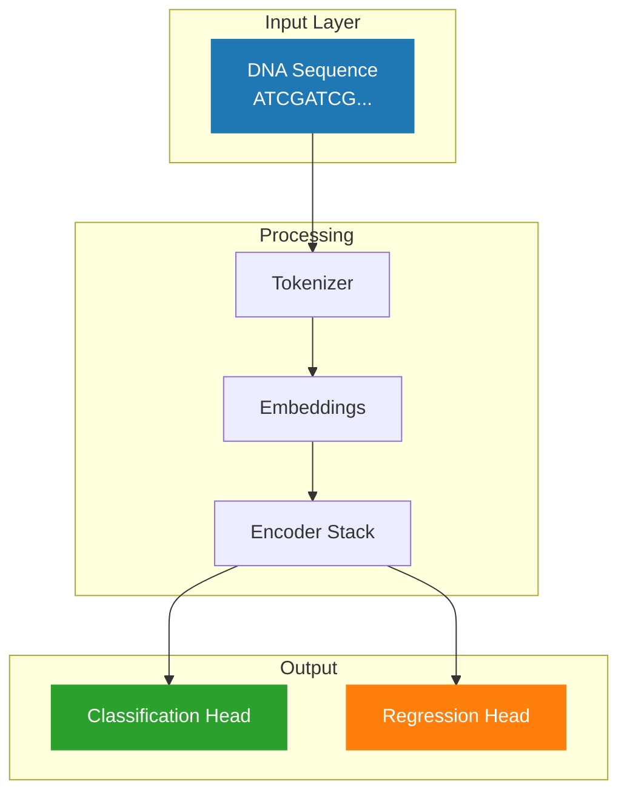
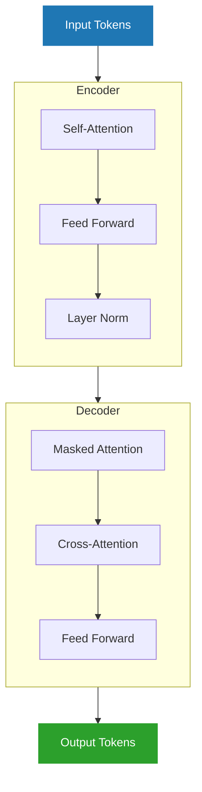
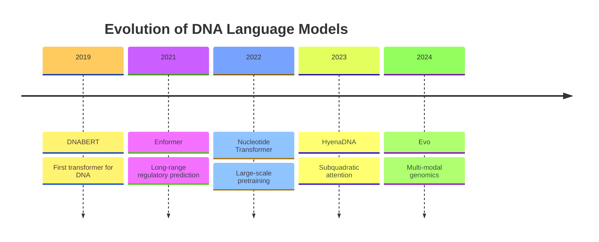
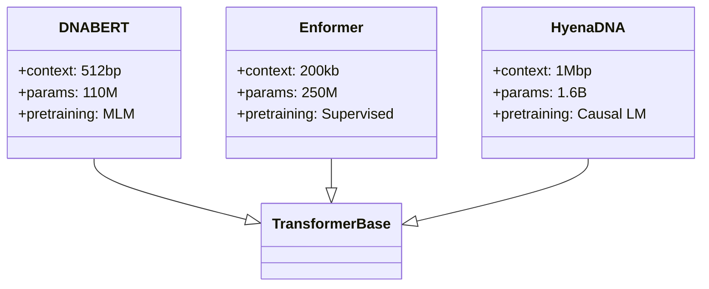
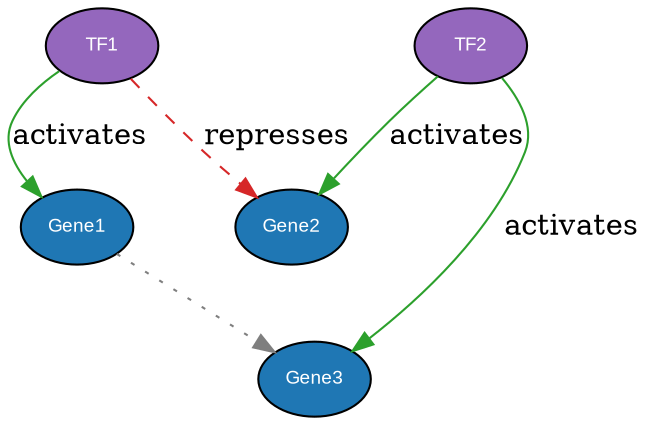
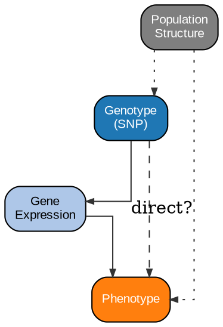
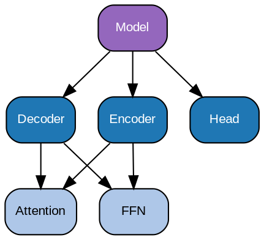
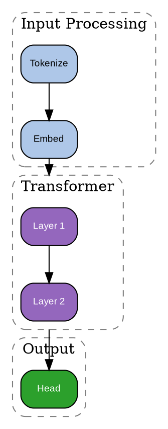

# Tool Templates

Code templates for Matplotlib, Mermaid, and Graphviz figure generation. These templates follow the book's visual style guidelines and genomics color conventions.

---

## Genomics Color Palette

Use these colors consistently across all figures:

```python
# Python/Matplotlib
COLORS = {
    'dna_primary': '#1f77b4',      # Blue
    'dna_secondary': '#aec7e8',    # Light blue
    'rna_primary': '#2ca02c',      # Green
    'rna_secondary': '#98df8a',    # Light green
    'protein_primary': '#ff7f0e',  # Orange
    'protein_secondary': '#d62728', # Red
    'model': '#9467bd',            # Purple
    'annotation': '#7f7f7f',       # Gray
    'highlight': '#ffbb78',        # Yellow
    'background': '#ffffff',       # White
}
```

```css
/* Mermaid/CSS */
%%{init: {'theme': 'base', 'themeVariables': {
    'primaryColor': '#1f77b4',
    'secondaryColor': '#aec7e8',
    'tertiaryColor': '#9467bd',
    'primaryTextColor': '#333333',
    'lineColor': '#7f7f7f'
}}}%%
```

---

## Matplotlib Templates

### Base Setup (all figures)

```python
#!/usr/bin/env python3
"""
Figure: [TITLE]
Chapter: [CHAPTER]
Description: [DESCRIPTION]
"""

import matplotlib.pyplot as plt
import numpy as np
import seaborn as sns
from pathlib import Path

# Style configuration
plt.style.use('seaborn-v0_8-whitegrid')
plt.rcParams.update({
    'font.family': 'sans-serif',
    'font.sans-serif': ['Arial', 'DejaVu Sans'],
    'font.size': 10,
    'axes.labelsize': 11,
    'axes.titlesize': 12,
    'xtick.labelsize': 9,
    'ytick.labelsize': 9,
    'legend.fontsize': 9,
    'figure.dpi': 150,
    'savefig.dpi': 300,
    'savefig.bbox': 'tight',
    'savefig.pad_inches': 0.1,
})

# Genomics color palette
COLORS = {
    'dna': '#1f77b4',
    'rna': '#2ca02c',
    'protein': '#ff7f0e',
    'model': '#9467bd',
    'highlight': '#ffbb78',
}

# Output path
OUTPUT_DIR = Path('figs/part_N/chXX')
OUTPUT_FILE = OUTPUT_DIR / 'NN-fig-name.svg'

def main():
    # Create figure
    fig, ax = plt.subplots(figsize=(6, 4))

    # [FIGURE CODE HERE]

    # Save
    OUTPUT_DIR.mkdir(parents=True, exist_ok=True)
    plt.savefig(OUTPUT_FILE, format='svg')
    plt.close()
    print(f"Saved: {OUTPUT_FILE}")

if __name__ == '__main__':
    main()
```

### Heatmap / Attention Matrix

```python
def create_attention_heatmap(data, labels=None):
    """Create attention/correlation heatmap."""
    fig, ax = plt.subplots(figsize=(6, 6))

    # Create heatmap
    im = ax.imshow(data, cmap='YlOrRd', aspect='equal')

    # Colorbar
    cbar = plt.colorbar(im, ax=ax, shrink=0.8)
    cbar.set_label('Attention weight', fontsize=10)

    # Labels
    ax.set_xlabel('Key position', fontsize=11)
    ax.set_ylabel('Query position', fontsize=11)
    ax.set_title('Self-attention pattern', fontsize=12, fontweight='bold')

    # Ticks (show subset for large matrices)
    n = data.shape[0]
    if n > 20:
        tick_positions = np.linspace(0, n-1, 5, dtype=int)
        ax.set_xticks(tick_positions)
        ax.set_yticks(tick_positions)

    plt.tight_layout()
    return fig
```

### Training Curve

```python
def create_training_curve(epochs, train_loss, val_loss, metric_name='Loss'):
    """Create training/validation curve plot."""
    fig, ax = plt.subplots(figsize=(6, 4))

    ax.plot(epochs, train_loss,
            color=COLORS['dna'], linewidth=2, label='Training')
    ax.plot(epochs, val_loss,
            color=COLORS['protein'], linewidth=2, linestyle='--', label='Validation')

    ax.set_xlabel('Epoch', fontsize=11)
    ax.set_ylabel(metric_name, fontsize=11)
    ax.set_title(f'{metric_name} during training', fontsize=12, fontweight='bold')
    ax.legend(frameon=True, fancybox=False, edgecolor='gray')

    # Clean up
    ax.spines['top'].set_visible(False)
    ax.spines['right'].set_visible(False)

    plt.tight_layout()
    return fig
```

### Bar Chart Comparison

```python
def create_comparison_bars(models, metrics, metric_name='Accuracy'):
    """Create model comparison bar chart."""
    fig, ax = plt.subplots(figsize=(8, 4))

    x = np.arange(len(models))
    colors = [COLORS['dna'], COLORS['rna'], COLORS['protein'], COLORS['model']]

    bars = ax.bar(x, metrics, color=colors[:len(models)], edgecolor='white', linewidth=1)

    # Value labels on bars
    for bar, val in zip(bars, metrics):
        ax.text(bar.get_x() + bar.get_width()/2, bar.get_height() + 0.01,
                f'{val:.2f}', ha='center', va='bottom', fontsize=9)

    ax.set_xticks(x)
    ax.set_xticklabels(models, rotation=45, ha='right')
    ax.set_ylabel(metric_name, fontsize=11)
    ax.set_title(f'{metric_name} by Model', fontsize=12, fontweight='bold')

    ax.spines['top'].set_visible(False)
    ax.spines['right'].set_visible(False)
    ax.set_ylim(0, max(metrics) * 1.15)

    plt.tight_layout()
    return fig
```

### Multi-panel Figure

```python
def create_multipanel(data_dict):
    """Create multi-panel figure with shared styling."""
    fig, axes = plt.subplots(1, 3, figsize=(12, 4))

    # Panel A
    ax = axes[0]
    ax.set_title('(A) First panel', fontsize=11, fontweight='bold', loc='left')
    # ... panel A content

    # Panel B
    ax = axes[1]
    ax.set_title('(B) Second panel', fontsize=11, fontweight='bold', loc='left')
    # ... panel B content

    # Panel C
    ax = axes[2]
    ax.set_title('(C) Third panel', fontsize=11, fontweight='bold', loc='left')
    # ... panel C content

    plt.tight_layout()
    return fig
```

### Sequence Logo (using logomaker)

```python
def create_sequence_logo(pwm_df):
    """Create sequence logo from position weight matrix.

    Args:
        pwm_df: DataFrame with columns A, C, G, T and position indices
    """
    import logomaker

    fig, ax = plt.subplots(figsize=(8, 2.5))

    logo = logomaker.Logo(pwm_df, ax=ax,
                          color_scheme='classic',
                          font_name='Arial Bold')

    ax.set_xlabel('Position', fontsize=11)
    ax.set_ylabel('Bits', fontsize=11)
    ax.set_title('Sequence motif', fontsize=12, fontweight='bold')

    # Style
    ax.spines['top'].set_visible(False)
    ax.spines['right'].set_visible(False)

    plt.tight_layout()
    return fig
```

---

## Mermaid Templates

### Basic Flowchart


### Vertical Pipeline



### Architecture Diagram



### Timeline / Gantt



### Comparison / Class Diagram



---

## Graphviz Templates

### Basic Directed Graph


### Gene Regulatory Network



### DAG / Causal Graph



### Hierarchical Layout



### Cluster / Subgraph



---

## Rendering Commands

### Matplotlib
```bash
python scripts/figures/chXX/figure_name.py
```

### Mermaid
```bash
# Standalone SVG
mmdc -i figure.mmd -o figure.svg -t neutral -b transparent

# With custom config
mmdc -i figure.mmd -o figure.svg -c mermaid-config.json
```

### Graphviz
```bash
# Standard render
dot -Tsvg figure.dot -o figure.svg

# Different layout engines
neato -Tsvg figure.dot -o figure.svg  # Spring layout
fdp -Tsvg figure.dot -o figure.svg    # Force-directed
circo -Tsvg figure.dot -o figure.svg  # Circular
```

---

## Common Adjustments

### Matplotlib
| Issue | Fix |
|-------|-----|
| Labels cut off | `plt.tight_layout()` or increase `figsize` |
| Text overlap | Reduce font size or rotate labels |
| Legend blocking data | `loc='upper left'` or `bbox_to_anchor` |
| Colors too similar | Use more distinct palette values |

### Mermaid
| Issue | Fix |
|-------|-----|
| Nodes too crowded | Add `\n` for line breaks in labels |
| Wrong direction | Change `flowchart LR` to `TD` or `TB` |
| Styling not applied | Check `%%{init:...}%%` syntax |

### Graphviz
| Issue | Fix |
|-------|-----|
| Nodes overlap | Add `nodesep=0.5` or `ranksep=0.5` |
| Edges crossing | Try `splines=ortho` or different `rankdir` |
| Labels unreadable | Increase `fontsize` |
| Wrong hierarchy | Use `{rank=same; ...}` to force alignment |
